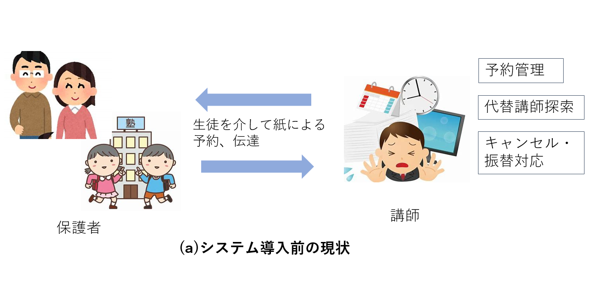
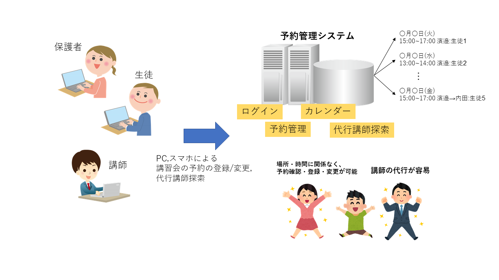

# 個別館RMS 要求仕様

# 1. システムの目的
- 本システムの目的は，某個別塾の講習会の予約管理業務をオンライン化し，生徒やその保護者が，場所や時間を選ばずに，講習会の予約を行うことを可能にすることである．
- これまでは，講師がシフトを提出し，生徒がその結果をもとに講習会予約を紙に書いて提出していたが，週1でしか授業がなく，生徒とのやりとりに時間がかかるという課題があった．
- そこで，講習会予約管理を行うシステムをWebアプリケーションとして実装し，生徒が自身の情報端末から，いつでもどこからでも，予約を登録・確認・変更できるようにする．本システムの導入により，講師は予約管理業務から解放され，業務のパフォーマンスが向上することが期待される．

# 2. システムの概要
- 本システムは，塾における講習会予約管理業務を，場所や時間を選ばずに行えるWebアプリケーションとして構築する．
- 下図(a)は，システム導入前の現状である．講師は，生徒を介して紙による講習会の予約・伝達を行っており，予約の管理等に時間がかかり，キャンセル・振替対応も行う必要があるという課題があった．

- 下図(b)は，システム導入後のあるべき姿である．システムは，講師・生徒・講師シフト・講習会予約のデータをシステム内で管理するWebアプリケーションとして実装される．ユーザはWebブラウザを開き，講師はシフトの登録や代行講師の検索を，生徒や保護者は講習会の予約・変更を場所．時間に関係なく行うことができる．

**(b)システム導入による効果**

- システムの導入により，生徒は手軽に講習会予約をできるようになり，講師は予約管理業務から解放され，他の業務に集中し，パフォーマンスが向上することが期待される．

# 3. 機能一覧
1. ユーザ管理機能
    - 講師や生徒をシステムのユーザとして登録・管理する機能
1. ログイン機能
    - ユーザがシステムを利用する際のログインを行う機能
1. カレンダー機能
    - 生徒が，システムに登録されているシフトをカレンダーで一覧する機能
    - 講師が，塾の開校日・閉校日を指定する機能
1. シフト管理機能
    - 講師が，自分のシフトの登録・変更を行う機能
1. 講習会予約管理機能
    - 生徒が，講習会の予約・変更・振替を行う機能
1. 代行講師検索機能
    - 講師が，担当している生徒の授業に入れないときに，代行の講師の検索を行う機能

# 4. 稼働開始時期
- 本システムの稼働開始日は，冬期講習に間に合うように，2021年12月1日とする． 